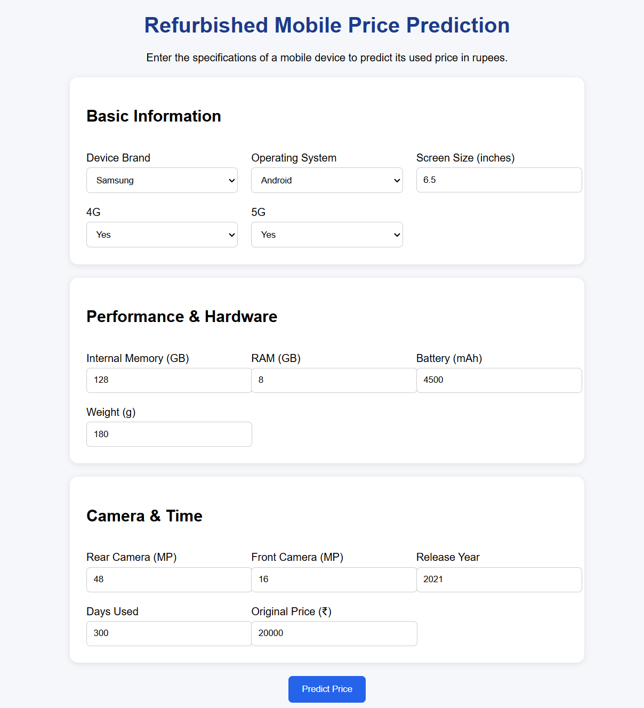

# Refurbished Mobile Price Prediction

A machine learning-based web application that predicts the resale price of refurbished or used mobile phones based on their specifications.

---

## Features

- Predicts used mobile price
- Simple web interface using Flask
- Uses Random Forest Regression
- Takes inputs such as:
  - Brand
  - RAM
  - Storage
  - Camera
  - Battery
  - Days Used
  - Release Year

---

## Screenshots

### Input Page

### Result Page

---

## Machine Learning Model

- Algorithm: Random Forest Regressor
- Dataset: Used mobile dataset
- Output: Predicted resale price

---

## Tech Stack

- Python
- Flask
- Pandas and NumPy
- Scikit-learn
- HTML, CSS, Bootstrap

---

## How to Run

1. Clone the repository

git clone https://github.com/Shravanee237/Refurbished-Mobile-Price-Prediction.git

2. Go to project folder

cd Refurbished-Mobile-Price-Prediction

3. Install dependencies

pip install -r requirements.txt

4. Run the application

python app.py

5. Open in browser

http://127.0.0.1:5000/

---

## Example

Input:
- Original Price: 20000
- RAM: 6GB
- Days Used: 300

Output:
- Predicted Price: 10500

---

## Future Improvements

- Improve model accuracy
- Add advanced models
- Deploy on cloud

---
